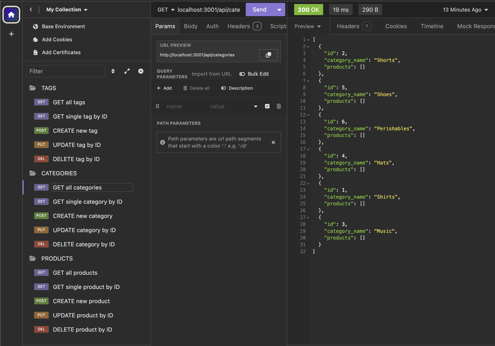
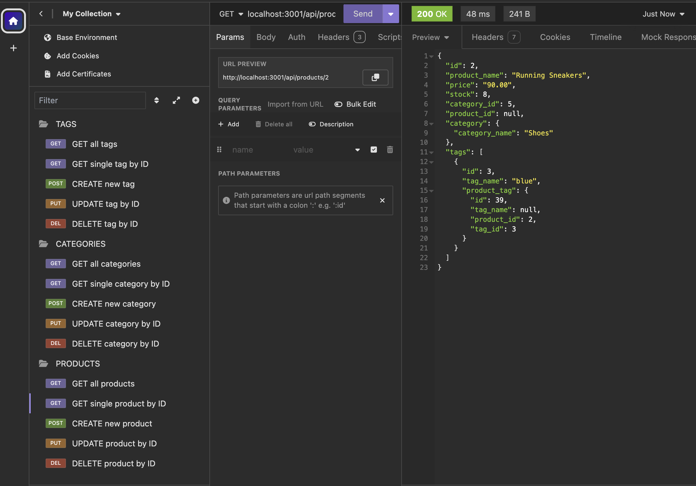

# BackTracker

## Description

BackTracker provides back-end object-relational mapping to manage an internet retail company's database. We use Express, Postgres and Sequelize to accomplish this. Optimize and modernize your company today with BackTracker.

## Table of Contents

- config
    - connection.js
- db
    - schema.sql
- models
    - Category.js
    - index.js
    - Product.js
    - ProductTag.js
    - Tag.js
- routes
    - api
      - category-routes.js
      - index.js
      - product-routes.js
      - tag-routes.js
- seeds
    - category-seeds.js
    - index.js
    - product-seeds.js
    - product-tag-seeds.js
    - tag-seeds.js
- package-lock.json
- package.json
- server.js
- license
- README.md file

## Tasks 

- WHEN I enter VS Code, THEN I see a list of files on the left hand side
- WHEN I open the integrated terminal, THEN I install sequelize, pg, express, and dotenv
- WHEN I enter node server.js on the command line, THEN I see the app is listening on the indicated port
- WHEN I open Insomnia and click various methods within the TAG, CATEGORY, or PRODUCT folders, THEN I observe an option to view all, view one, create one, update one, or delete one from its respective folder

## Usage
Here are sample images from Insomnia using BackTracker:

## Links
- Video Usage [link to video](https://youtu.be/WF1X0kVQVD4): https://youtu.be/WF1X0kVQVD4
- Deployed Webpage: https://scurvyirv.github.io/backtracker/
- GitHub Repo Page: https://github.com/scurvyirv/backtracker

## Credits

- Postgres Package: https://www.npmjs.com/package/pg
- Inquirer Package: https://www.npmjs.com/package/inquirer
- Node JS Package: https://docs.npmjs.com/downloading-and-installing-node-js-and-npm 
- Sequelize Package: https://www.npmjs.com/package/sequelize
- Express Package: https://www.npmjs.com/package/express
- DotEnv Package: https://www.npmjs.com/package/dotenv

## License

MIT License

Copyright (c) 2024 scurvyirv

Permission is hereby granted, free of charge, to any person obtaining a copy of this software and associated documentation files (the "Software"), to deal in the Software without restriction, including without limitation the rights to use, copy, modify, merge, publish, distribute, sublicense, and/or sell copies of the Software, and to permit persons to whom the Software is furnished to do so, subject to the following conditions:

The above copyright notice and this permission notice shall be included in all copies or substantial portions of the Software.

THE SOFTWARE IS PROVIDED "AS IS", WITHOUT WARRANTY OF ANY KIND, EXPRESS OR IMPLIED, INCLUDING BUT NOT LIMITED TO THE WARRANTIES OF MERCHANTABILITY, FITNESS FOR A PARTICULAR PURPOSE AND NONINFRINGEMENT. IN NO EVENT SHALL THE AUTHORS OR COPYRIGHT HOLDERS BE LIABLE FOR ANY CLAIM, DAMAGES OR OTHER LIABILITY, WHETHER IN AN ACTION OF CONTRACT, TORT OR OTHERWISE, ARISING FROM, OUT OF OR IN CONNECTION WITH THE SOFTWARE OR THE USE OR OTHER DEALINGS IN THE SOFTWARE.